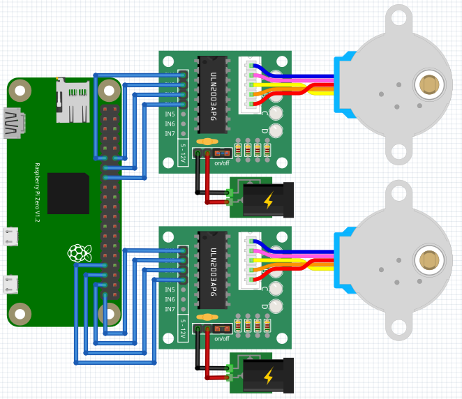
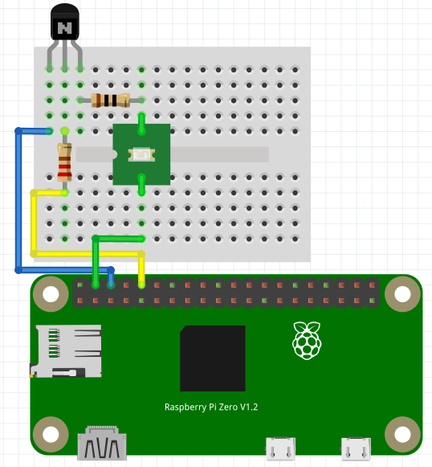

# Smart Medication Dispenser
Currently, doctors do not have a way to control when patients take their medications nor the amount of medications taken. As a solution to this problem, we introduce the Smart Medication Pill Dispenser. The project is composed of three main parts: an embedded system, a server, and a mobile user interface.
 
The embedded device, controlled by a Raspberry Pi, will feature compartment systems for controlled medicine delivery and a camera that works together with a high accuracy weight sensor that will verify when a patient has picked up their medication from the device.
 
The device will connect to a server which tracks timestamps and other user information and implements an artificial intelligence algorithm to detect, count, and potentially classify pills once they are released by the device. The server will communicate with the device for pill delivery timing, and with the mobile application to interface with patients and doctors.

The mobile frontend will allow doctors to receive a live image feed of the state of the medicine through a mobile application for iOS phones and look at timestamp logs of pill delivery and removal by the patient. Additionally, this application will allow doctors to manage medications and schedule when the medications are delivered to the patient. 

## Hardware Requirements 
+ Raspberry PI Zero W
  + with Raspberry Pi OS
+ 5VDC Stepper Motor (28BYJ-48) and ULN2003 Driver
+ Raspberry Pi Camera Module v1.3
+ Xiaoyztan White Light LED (Power: 1 Watt, Forward Current: 350mA, Forward Voltage: 3.0-3.2V)
  + 2N222 NPN Transistor 
  + One of each (10 Ω and 220 Ω resistor)

## Software Requirements
+ Python
+ Python libraries: `boto3`
  + Note: `picamera` and `RPi` are preinstalled in Raspberry Pi OS 


## Installation and How-to-Run
Simply clone this reposition into your Raspberry PI and execute the main file. 
```
$ Git clone https://github.com/fpena2/Medication-Dispenser.git
$ cd Medication-Dispenser
$ python3 run.py
```

## Pin-out and Connections 

1. Motor 1 & Motor 2
<p style="width: 50%;">
</img>
</p>

2. LED 
<p style="width: 50%;">
</img>
</p>

## Contributing 🚀
If you would like to improve this system, simply fork the repo and make a pull request with your changes.

